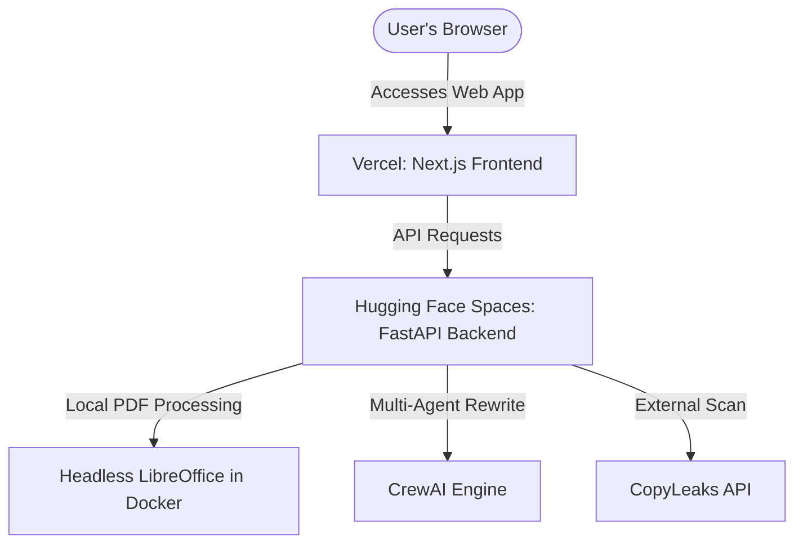

# Deployment Guide - Free & Unlimited Live Hosting (Vercel + Hugging Face Spaces)

This guide outlines how to deploy the **Next.js frontend** and the **FastAPI backend** for free, permanently live (unlimited running without cold sleeps), and with **headless LibreOffice** configured to convert DOCX to PDF.

---

## Architecture Overview



---

## 1. Backend Deployment (FastAPI on Hugging Face Spaces)

Hugging Face Spaces offers a free Docker container hosting option that remains permanently live and active (unlimited uptime, no inactivity spin-downs if built as a Space).

### Step 1: Create a Space on Hugging Face
1. Go to [Hugging Face Spaces](https://huggingface.co/spaces).
2. Click **Create new Space**.
3. Set your Space name (e.g. `authenticite-api`).
4. Select **Docker** as the SDK (instead of Streamlit or Gradio).
5. Choose **Blank** template.
6. Set visibility to **Public** or **Private** (Public spaces are free; Private spaces require a pro account for persistent hardware, but standard public spaces remain active indefinitely).

### Step 2: Create a Dockerfile in the Backend
Create a `Dockerfile` at the root of your backend directory (or repository) to install **LibreOffice headless**, **tesseract OCR**, and run the FastAPI app.

Here is the exact `Dockerfile` configuration:

```dockerfile
FROM python:3.10-slim

# Install system dependencies (LibreOffice, Tesseract OCR, and utilities)
RUN apt-get update && apt-get install -y --no-install-recommends \
    libreoffice \
    tesseract-ocr \
    libtesseract-dev \
    gcc \
    g++ \
    curl \
    && apt-get clean \
    && rm -rf /var/lib/apt/lists/*

# Set up app directory
WORKDIR /code

# Copy requirements and install python packages
COPY ./backend/requirements.txt /code/requirements.txt
RUN pip install --no-cache-dir --upgrade -r /code/requirements.txt

# Copy source code
COPY ./backend /code/backend
COPY ./run.py /code/run.py

# Create directory structures for uploads/outputs
RUN mkdir -p /code/uploads/media /code/output

# Set environment variable to make FastAPI listen on port 7860 (Hugging Face requirement)
ENV PORT=7860
EXPOSE 7860

# Run using uvicorn
CMD ["python", "run.py"]
```

### Step 3: Add Space Secrets (Environment Variables)
In your Hugging Face Space settings, add the following variables under **Variables and secrets**:
- `GEMINI_API_KEY`: Your Gemini API key.
- `DEEPSEEK_API_KEY`: Your DeepSeek API key.
- `COPYLEAKS_EMAIL`: Your CopyLeaks registered email.
- `COPYLEAKS_API_KEY`: Your CopyLeaks API key.
- `USE_COPYLEAKS`: `True` (to enable external scans).
- `USE_CREWAI`: `True` (to enable multi-agent CrewAI rewrites).
- `USE_MARKER`: `True` (to enable Marker PDF parsing).

---

## 2. Frontend Deployment (Next.js on Vercel)

Vercel is the official platform for Next.js, providing free global CDN hosting with unlimited active uptime.

### Step 1: Push Frontend to GitHub
Ensure your repository has the Next.js frontend code in the `frontend` subdirectory.

### Step 2: Configure Vercel Project
1. Log in to [Vercel](https://vercel.com).
2. Click **Add New** -> **Project**.
3. Import your GitHub repository.
4. Set **Root Directory** to `frontend`.
5. Under **Build & Development Settings**, Vercel will automatically detect Next.js.
6. Under **Environment Variables**, add:
   - `NEXT_PUBLIC_API_URL`: Set this to your Hugging Face Space URL (e.g., `https://username-space-name.hf.space` or the direct backend endpoint).

### Step 3: Deploy
Click **Deploy**. Vercel will build the frontend and host it at a custom `.vercel.app` domain.

---

## 3. Local Verification of LibreOffice Conversion

Headless conversion runs via shell execution. The backend automatically searches for the `libreoffice` binary path.

### Linux/Docker Command:
```bash
libreoffice --headless --convert-to pdf --outdir /code/output /code/output/rebuilt_paper.docx
```

### Windows Local Testing:
If running locally on Windows, ensure LibreOffice is installed (typically at `C:\Program Files\LibreOffice\program\soffice.exe`) and added to your System PATH variables.
